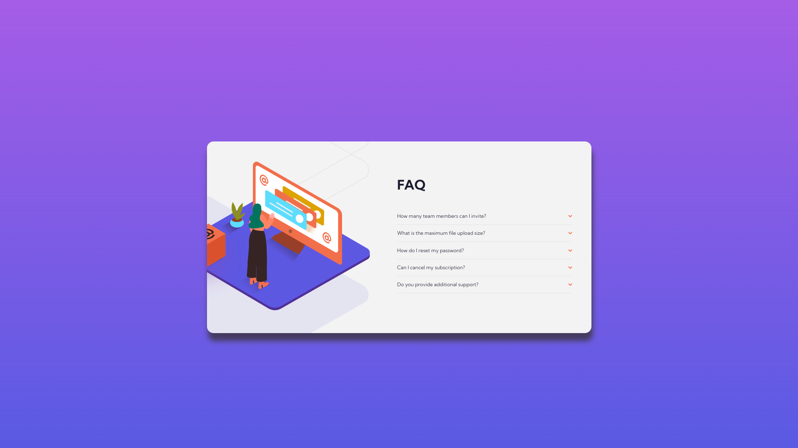

# Frontend Mentor - FAQ accordion card solution

This is a solution to the [FAQ accordion card challenge on Frontend Mentor](https://www.frontendmentor.io/challenges/faq-accordion-card-XlyjD0Oam). Frontend Mentor challenges help you improve your coding skills by building realistic projects. 

## Table of contents

- [Overview](#overview)
  - [The challenge](#the-challenge)
  - [Screenshot](#screenshot)
  - [Links](#links)
- [My process](#my-process)
  - [Built with](#built-with)
  - [What I learned](#what-i-learned)
  - [Continued development](#continued-development)
  - [Useful resources](#useful-resources)
- [Author](#author)
- [Acknowledgments](#acknowledgments)

## Overview

### The challenge

Users should be able to:

- View the optimal layout for the component depending on their device's screen size
- See hover states for all interactive elements on the page
- Hide/Show the answer to a question when the question is clicked

### Screenshot

### Links

- Solution URL:(https://github.com/sclingan/faq-accordion-card-main)
- Live Site URL:(https://sclingan.github.io/faq-accordion-card-main)

## My process

### Built with

- Semantic HTML5 markup
- CSS custom properties
- Flexbox
- CSS Grid
- Mobile-first workflow

### What I learned
I learned more semantic HTML elements like Summary and Details to
make an accordion without using Javascript. I did use Javascript to add additional functionality(only letting one section open at
a time).

### Continued development
I would like to come back to this challenge to make more improvements, I need to work more on layout and responsive
sites. I plan to work more on mobile design and integrate
landscape media queries.

### Useful resources

- (https://w3schools.com) - A great place to learn HTML, CSS and JavaScript.
- (https://validator.w3.org/) - Test all your sites and learn more
about semantic HTML and Accessibility.

## Author

- Frontend Mentor - [@sclingan](https://www.frontendmentor.io/profile/sclingan)

## Acknowledgments
I would like to thank Frontend Mentor for a great challenge to 
help me learn.
